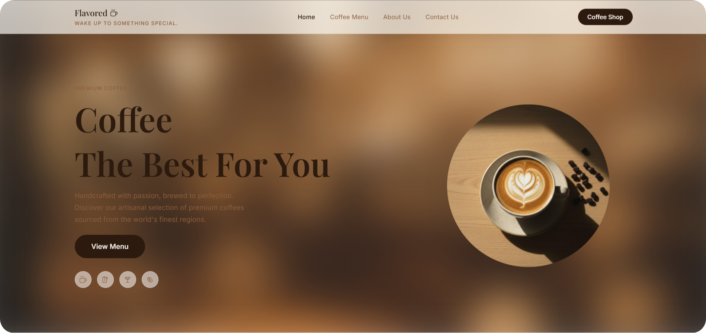

<div align="center">

<a href="[./public/images/preview.png](https://coffee-shop-web-ten.vercel.app/)">
  
</a>

</div>

# ☕ Flavored

> A cinematic coffee shop landing page built with React + Vite.

Flavored delivers a premium café-inspired experience using glassmorphism UI, smooth scrolling, cinematic animations, and warm editorial aesthetics.

---

## ✨ Features

- 🌫 Blurred café bokeh background
- 🪟 Frosted glassmorphism UI
- 🎞 GSAP cinematic scroll animations
- ⚡ Smooth Lenis scrolling
- ☕ Floating coffee compositions
- 🖱 Interactive custom cursor
- 📱 Handcrafted mobile app mockups
- 🎨 Editorial typography layouts
- 📱 Fully responsive design

---

## 🚀 Tech Stack

| Technology | Purpose |
|------------|---------|
| React + Vite | Frontend Framework |
| Tailwind CSS | Styling |
| Framer Motion | UI Animations |
| GSAP + ScrollTrigger | Scroll Animations |
| Lenis | Smooth Scrolling |
| Lucide React | Icons |

---

## 📸 Website Sections

### Hero Section
- Floating latte-art coffee composition
- Cinematic text reveal animations
- Interactive category icons
- Premium CTA button

### Product Showcase
- Frosted coffee product cards
- Hover lift interactions
- Floating pricing badges

### Feature Section
- GSAP coffee bean explosion animation
- Scroll-linked cinematic motion

### App Showcase
- Handcrafted glassmorphism phone mockups
- CSS-based mobile UI recreation

### CTA Banner
- Animated reservation section
- Clip-path reveal transitions

### Footer
- Editorial multi-column layout
- Staggered reveal animations

---

## ⚙ Installation

Clone the repository:

```bash
git clone https://github.com/jayesh77t/Coffee-Shop-Web.git
```

Go to the project folder:

```bash
cd Coffee-Shop-Web
```

Install dependencies:

```bash
npm install
```

Start development server:

```bash
npm run dev
```

---

## 📂 Project Structure

```bash
src
├── assets
├── components
├── sections
├── hooks
├── animations
├── styles
├── App.jsx
└── main.jsx
```

---

## 🎞 Animation System

| Element | Animation |
|---|---|
| Hero Heading | Slide In |
| Coffee Cup | Float + Rotate |
| Product Cards | Fade Up |
| Coffee Beans | GSAP Explosion |
| Buttons | Fill Animation |
| Footer Columns | Stagger Reveal |

---

## 📱 Responsive Design

Optimized for:

- Desktop
- Tablet
- Mobile Devices

---

## ⚡ Performance

- GPU accelerated transforms
- Optimized GSAP timelines
- Smooth hardware-accelerated motion
- Lightweight SVG icon system

---

## 🔮 Future Improvements

- Dark Mode
- Three.js Coffee Particles
- Reservation Backend
- AI Coffee Recommendations
- Full eCommerce Integration

---

## 📄 License

This project is licensed under the MIT License.

---

## ☕ Experience Goal

Flavored is designed to feel warm, cinematic, calm, and premium — transforming a coffee shop website into an immersive editorial experience through motion, blur, typography, and interaction design.
